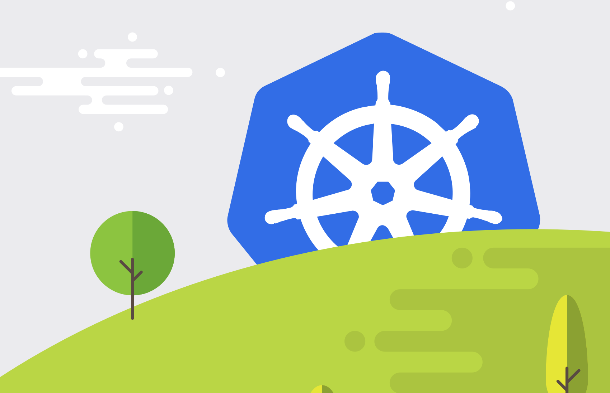
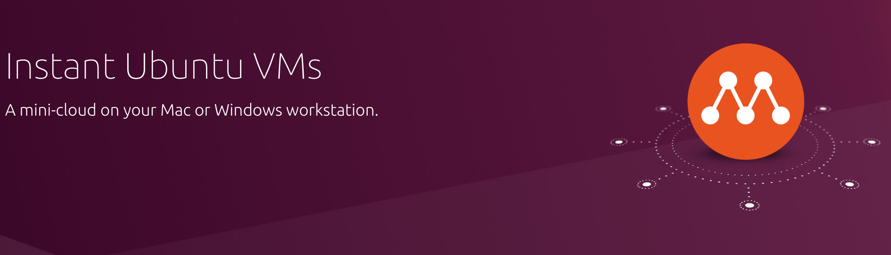

# Introduction Kubernetes Container Platform Management
(แต่สำหรับผู้เรียนรู้ใหม่การเรียนรู้ Kubernetes แบบลึกๆจนไปถึงแก่นนั้นเป็นสิ่งสำคัญนะ ! เพราะจะชวยให้เราต่อยอดเองได้ในอนาคตรวมไปถึงการ Debug ด้วยซึ่งสามารถตามไปที่ Repository ของอาจารย์จุ๊บ Damrongsak ได้กับ Kubernetes Hardway ซึ่งเป็น Repository ที่ดีมากๆ)

แน่นอนว่าหลายๆคนในช่วงนี้ย่อมเคยได้ยินถึง Kubernetes และใช้งานกันแล้วบ้างซึ่งจะเห็นได้เลยว่า Kubernetes คือ Container Orchestration Platform 
ที่ช่วยให้เราสามารถจัดการควบคุม Application ที่ pack เป็น Container Image เรียบร้อยแล้วแต่ต้องการ Deploy ไปหลายๆ Application และจะทราบได้อย่างไรว่า Application เหล่านัั้นทำงานแล้วมีปัญหาหรือไม่ ควรรับ Traffic ที่ Request เข้ามาหรือเปล่า ?  หรือควรพักไว้ก่อนเพราะว่า Application เรารับโหลดไม่ไหวและเริ่ม Delay แล้ว ซึ่งการจัดการในเชิง Platform Infrastructure ของ Application ก็จะถูกจัดการให้ง่ายด้วยด้วยการใช้ Kubernetes ซึ่งเราจะลองยกตัวอย่างให้ดูจากตัวอย่างเหล่านี้ครับ ว่า Kubernetes ใน Concept นั้นทำอะไรได้บ้าง 

1. การกำหนด Resource ของ Application ตัวนี้สามารถใช้ Memory ได้เท่าไหร่ ? หรือใช้กำลัง CPU ในการประมวลผลได้กี่ Virtual Core ภายใน Namespace นั้นผ่าน Resource Quota วึ่งก็จะช่วยให้ทั้งทีม Devloper และ Operation ทราบถึงปริมาณการใช้งานและกำหนดขอบเขตการใช้งานไม่ให้ไปแย่งใช้งานกับ Application ตัวอื่นได้ หรือถ้าเป็นในด้าน Network ก็จะพบว่า Kubernetes 
2. สามารถช่วยให้เราสร้าง Service Discovery กันภายใน Cluster ได้อย่างง่ายดายซึ่ง Service Discovery จะเข้ามาแก้ปัญหา Pattern เดิมๆที่เราต้องออกแบบใน Infrastructure แบบ Production นั้นก็คือการทำ High Availability ซึ่งก็หมายความว่า Application ที่ Deploy ขึ้นระบบไปแล้วนั้นจะต้องไม่อยู่ตัวคนเดียวและถ้าหาก Application ณ จุดนั้นล่มไปจะต้องไม่ทำให้ระบบเกิดล่มลงไปเป็นสิ่งที่เรียกว่า Single Point of Failure เราเลยต้องทำการ Deploy Application แบบ Redundancy กันหลายๆที่ (คนล่ะ Physical Host) เพื่อป้องกันเหตุการณ์ว่าถ้าเกิด Host จริงๆที่ติดตั้ง Application ที่ Deploy อยู่เกิดล่มลงไปจะไม่กระทบต่อ Business User ที่ใช้งานอยู่ แต่กระนั้นเองการทำ High Availability เช่นนี้ก็ต้องแรกมากับการที่ไปขยายจุด Failure ในจุดอื่นแทนด้วยการให้มี Load Balancer เป็นจุดกระจาย Load ไปยัง Application ที่อยู่กันคนล่ะ Host IP คนล่ะเบอร์กัน แต่ปัญหาที่ตามมาก็คือแล้วเราจะทำอย่างไรถ้าหากเรามี Application ที่สามารถเพิ่มลดตัวเองได้ตลอดเวลาและ IP ก็ Dynamic เปลี่ยนไปเรื่อยๆ การแก้ไขไฟล์ Config เหล่านั้นก็คงปวดหัวน่าดู แต่ Kubernetes เองก็เข้ามาแก้ปัญหาเหล่านี้ด้วยการใช้ Service ไปจับกับ Label ของ Pod ที่ Deploy ขึ้นมาและ Register ลงไปใน CoreDNS ทำให้ปัญหาเรื่องของ Service Discovery ถูกแก้ไป (ถ้าเป็นใน Netflix Stack นั่นก็คือ Eureka Service)
3. Storage Abstraction ด้วยการใช้ Container Storage Interface ทำให้ผู้ใช้ที่เป็น Developer ไม่จำเป็นต้องสนใจว่า Disk ที่ถูกสร้างไปนั้นจะใช้เป็น Disk ประเภทใดแต่ประเภทของ Disk ก็ถูกจัดการและ Abstract โดย Admin อีกทีอย่างเช่นกาออกแบบ Storage Class ทิ้งเอาไว้ก่อนและให้ Developer ขอ Volume ของ disk แล้วก็ใช้งานได้เลยหากเงื่อนไขของ Disk นั้นตรงกันกับ Storage Class ที่ออกแบบไว้ตอนแรก

ซึ่ง Kubernetes นั้นจะเปรียบเสมือนกับ Datacenter สำหรับ Application เต็มๆที่เราต้องคอยเลือกจัดการพวก Solution Network, Storage, หรือ Strategy เหล่านี้เองได้ด้วยตัวเราทั้งหมด แต่ในขณะเดียวกันถ้าหากเราต้องการจะใช้งานแบบ Production ซึ่งต้องการเห็นภาพรวมทั้งหมดของระบบที่มี Scale ใหญ่มากๆจริงๆ การใช้คำสั่งผ่าน kubectl เพื่อดูแต่ล่ะ Application ที่ Deploy ขึ้นไปก็อาจจะเป็นเรื่องที่ยากเช่นกัน  จากการที่ต้องมาดูจาก text ผ่าน Commandline ทีล่ะจุด ลองจินตนาการว่าเรามี Application สัก 10 ตัว แต่ล่ะตัวมี Database, Backend และ Frontend เป็นของตัวเองและมีการทำ HA ในทุกๆ Deployment ว่าต้อง Deploy ไปแล้วแยกอยู่คนล่ะเครื่องจริงๆด้วยนะ ไม่ใช่แค่ ใช้คำสั่ง kubectl scale --replicas แล้วสุดท้ายทุกอย่างยังอยู่เครื่องเดิม หรือไป Deploy ในเครื่องที่ล่อแหลมอย่าง Ram น้อยเกินไปหรือมีสถานะแปลกๆที่เราคิดแล้วว่าไม่เหมาะสมต่อการ deploy จากที่เราออกแบบแปะ Label ไว้ที่ Node นั้นๆเช่นเครื่องนี้ใช้ CPU Intel เราจะไม่ไป Deploy ที่เครื่องนี้ ซึ่งเทคนิดพวกนี้เราสามารถจัดการได้ด้วยการใช้ Taint,Toleration, Pod Affinity เข้ามาจัดการได้ซึ่งเป็น Config พื้นฐานของ Kubernetes อยู่แล้ว
แต่ในแง่ของการจัดการหรือช่วยให้เรามองเห็นปัญหาหรือสถานการณ์ในภาพรวมได้การใช้แค่ kubectl เพื่อดูผ่าน terminal คงจะไม่พอถ้าหาก Application ของเรามีความซับซ้อนดั่งตัวอย่างนี้ ซึ่งหลังจากนี้เราจะลองมาดูกันว่าแล้ว Rancher ซึ่งเป็น Kubernetes Management Platform อีกทีช่วยอะไรเราได้บ้าง ? (Inception มาก Manage ใน Manage อีกที 5555)

# Rancher Kubernetes Management Platform 
จากประโยชน์ทั้งหมดนั้นเราจะเห็นได้แล้วว่า Kubernetes เข้ามาช่วยในการจัดการขั้นตอนในการ Deploy Container ให้กับเราจริงๆแต่ถ้าให้ลองนึกไปถึงอีกระดับนึงแล้วแล้วอะไรล่ะที่จะเข้าไป Manage Kubernetes ที่เรามีอยู่แล้วได้อีกทีกันนะ ?
1. Kubernetes Cluster Provisioning & Life Cycle Management: เรานั้นทราบกันดีว่าการสร้าง Kubernetes ก็มีวิธีให้เลือกได้หลายแบบตั้งแต่การใช้ KOPS เพื่อ Provisioning บน AWS หรือจะใช้ Kubeadm ซึ่งเป็น Official Tools ให้ติดตั้ง Kubernetes Cluster ได้อย่างสะดวกสบายกว่าการติดตั้งแบบ Hardway เพราะช่วยในการ Abstract ความซับซ้อนอย่างขั้นตอนการ Generate Certificate ไปรวมไปถึงการ Join Cluster ก็ทำได้ง่ายขึ้น  แต่ในกรณ๊  Scale ขององค์กรขนาดใหญ่แล้วที่ต้องการ Provisioning Cluster หลายๆ Cluster เพื่อแยกแต่ล่ะแผนกหรือแต่ล่ะงานตามแต่ที่นโยบายกำหนดมา (เช่นไม่ยากให้ข้อมูลมีโอกาสหลุดไปเห็นโดย Developer ที่ไม่เกี่ยวข้องกับงานนั้นๆเลย) การ Provisioning ด้วยตัวเราแบบ Manual จำนวนมากๆก็อาจจะเป็นเรื่องที่มีความซับซ้อนเพิ่มขึ้นมาบ้าง  เพราะแต่ล่ะ Cluster ที่ถูกสร้างขึ้นมานั้นก็จะไม่มีความเกี่ยวข้องกันไม่สามารถสรุปผลของภาพรวมจากศูนย์กลางที่เดียวได้ เมื่อเวลาผ่านไปก็อาจจะเริ่มสับสนว่า Cluster นี้ถูกสร้างไว้ที่ไหนโดยใครบ้าง หรือถ้าอยากจะลบ Cluster เหล่านั้นล่ะจะทำอย่างไร ? ซึ่งปัญหานี้ก็จะถูกแก้ด้วยการใช้ Rancher ซึ่งเป็น Deployment หนึ่งที่ใช้ในการจัดการ Cluster Kubernetes อีกที โดยแต่ล่ะ Cluster นั้นก็จะถูกเชื่อมเข้ามาหา Management ซึ่งความสามารถนี้ไม่ใช่แค่การสร้าง Cluster ผ่าน GUI ใน Rancher เท่านั้น แต่ Rancher ยังสามารถออกแบบ Template ของ Kubernetes ที่จะ Provisioning ได้อีกด้วยผ่าน Rancher Kubernetes Engine Template (เหมือนเป็น Template ที่มีไว้ Reuse ว่า Configuration ของ Kubernetes ต้องเป็นแบบใดใช้ Kubernetes Version ไหน, Docker Engine อะไร Parameter ต่างๆ)  ตรงจุดนี้เองจะทำให้ทั้งองค์กรเรามีการใช้ Kubernetes แบบ Scale ใหญ่ๆและต้องการความ Consistency ทั้งระบบมีความสะดวกสบายมากขึ้น   และยังมีเรื่องของการ Backup ETCD Database ซึ่งเป็น Key Value Databaase ที่สำคัญของ Kubernetes เพราะใช้ในการเก็บสถานะทั้ง Cluster ว่าตอนนี้ Cluster มี Pod อะไรบ้างมี Object อยู่ใน Namesapce ไหน ? พูดอย่างง่ายๆคือทุกอย่างที่เป้น YAML Object Kubernetes ทั้งหมดนั้นถูก Backup ไว้ที่ ETCD ดังนั้นถ้าเกิด ETCD ล่มไป State ของ Cluster ก็จะหายทันที ซึ่งสิง่สำคัญของ Kubernetes Management Paltform จึงควรให้ความสำคัญกับการ Backup  ETCD Database ด้วยเช่นกัน ซึ่ง Rancher เองก็มี Feature นี้ให้ด้วยเช่นเดียวกัน (รายละเอียดจะถูกกล่าวเพิ่มเติมต่อไปครับ) 
   
2. User Management: ทุกๆ Application ใดๆล้วนแล้วแต่มีการทำ Authentication/ Authorization กันเกือบหมดเพราะจะได้ทราบว่าสิทธิของ User คนนั้นที่ควรจะได้คืออะไรบ้าง ซึ่งแน่นอนแล้วว่า kubernetes เองก็สามารถสร้าง user ขึ้นมาได้ด้วยนะ แต่สิ่งสำคัญที่จะเน้นย้ำก็คือจริงๆแล้ว User ใน Kubernetes นั้นไม่ได้มี Feature เรื่องของการทำ Authentication ตรงๆในตัวอย่างเช่นการ Sync กับ LDAP เพื่อนำ User เข้าสู่ระบบแต่ว่าใช้หลักการสร้าง Certificate ของ User คนนั้นขึ้นมาแล้วก็ทำงาน Upload Cert ผู้ใช้คนนั้นเข้าไปในระบบและกำหนดเอาไว้ผู้ใช้คนนี้สามารถ Access API Kbuernetes อะไรได้บ้างผ่านการสร้าง Role/ ClusterRole แล้วเราก็กำหนด Role Based Access Control เอาด้วยตัวเราเอง ซึ่งแน่นอนว่าการ config เหล่านี้หากเราเป็น Developer หรือทำเพื่อ Delivery Application ที่ไม่ได้มีผู้ใช้แชร์ร่วมกันกับคนอื่นในองค์กรขนาดใหญ่การทำ RBAC ผ่าน manifest YAML ก็ดูไม่ได้เสียหายอะไรและก็สะดวก  แต่สำหรับองค์กรขนาดใหญ่ๆหรือจริงๆไม่ต้องใหญ่มากก็ได้เพียงแต่ว่าองค์กรเรามี Process ในการทำงานที่เหมาะสมว่าใครควรจะสามารถ Access อะไรได้บ้างไม่อย่างนั้น Developer ที่พึ่งเข้ามาใหม่แล้วใช้ Account ที่มี permission ทำได้ทุกอย่างแล้วเผลอไปลบ Deployment จริงๆของ Application ในระบบขึ้นมาแล้วอยู่ในระหว่าง Production ขึ้นมา ก็คงเป็นเหตุการณ์ที่ไม่มีใครอยากให้เป็นนัก  ซึ่งการจัดการสิทธิเหล่านี้นั้นใน Kubernetes Dashbaord ก็จะไมไ่ด้แสดงให้เห็นตรงๆว่าเรามี User เป็นใครและทำอะไรได้บ้างผ่าน GUI แต่ถ้าจะมาดูแบบลึกๆก็คงต้องดูผ่าน YAML ผ่าน kubectl auth can-i นั่นเอง  ซึ่งตรงนี้เองก็จะเป็นจุดนึงที่ Rancher อันเป็น Kubernetes Management Platform เข้าไปช่วยกันการในเรื่องการของการทำ Authentication ได้ด้วยนั้นเองรวมถึงเห็นได้ว่าเรามี User กี่คนในระบบแต่ล่ะคนสามารถมีสิทธิ Read, Write Object ใดใน Namespace ใดได้บ้าง ซึ่งก็จะเป็น RBAC ที่มีความละเอียดชัดเจนและเป็นทางการเหมาะกับการใช้ในการ Production จริงๆมากขึ้นนั่นเอง 
    
3. Developer Experience ที่ดีขึ้น Application จะออกมาดีได้ก็ต้องเกิดจากนักพัฒนาและทีมงานในองค์กรเราเองด้วยที่รู้สึกว่าเทคโนโลยีใหม่ๆเข้ามาช่วยอำนวยความสะดวกให้พร้อมจะใช้งานทันที โดยไม่จำเป็นต้องทำงานเดิมๆซ้ำอย่างเช่น Developer ของเราอยากจะได้ความสามารถของ Service Mesh ในตัว Rancher 2.5 ปัจจุบันเองนั้นก็จะรองรับ Istio 1.7 ซึ่งมาพร้อมกับความสามารถของ Service Mesh ที่จะช่วยให้ Infrastructure ของเราสามารถสร้างโอกาสการ Deploy ใหม่ๆเพิ่มความเสถียรในการ Deploy มากขึ้นเห็นภาพรวมใน Microservice จากการทราบว่า Request แต่ล่ะจุด Tracing แล้วเกิดคอขวดที่จุดใดบ้าง  หรือการ Provisiong แอพพลิเคชั่นอย่างง่ายดีผ่าน Helm Chart ซึ่งแน่นอนว่า Helm เป็นอีกเครื่องมือหนึ่งที่ช่วย Pack Kubernetes Object สำเร็จรูปเอาไว้แล้วเหมาะกับการ Deploy Application ที่เป็น Infrastructure มีเวอร์ชั่นชัดเจนและสามารถปรับแต่งจำนวนมากๆได้อย่างเช่นการ Deploy MySQL  Database เราสามารถใช้ commandline Helm เพื่อทำการดึง Template manifest ที่มี developer คนอื่นสร้างเอาไว้ใน Helm Repository มาใช้งานได้ทันทีพร้อมกับปรับแต่ง config ต่างๆได้ผ่าน values.yaml ซึ่งจะเป้นการ passing ค่าลงไปใน Tempalte ของ Helm เช่น MySQL นี้มี User ชื่ออะไร, Password อะไรล่ะ ? แล้วเริ่มทำงานที่ Port ไหนผ่านตัวแปรที่ Developer ที่สร้าง Helm Chart ออกแบบเอาไว้  แต่กระนั้นเองการ Deploy และ Config Infrastrucutre จะดีขึ้นและให้ความรู้สึกสนุกขึ้นไหม ถ้าหากเราสามารถกดผ่าน GUI และให้ Rancher ไปทำการ Deploy Helm Chart ให้และไม่จำเป้นต้องแนบ values.yaml ซึ่งใช้ในการ assing argument ผ่าน commandline แต่สามารถกรอกผ่านหน้า GUI ได้เลย ตัวนี้เองก็เป็นอีกสิ่งสำคัญที่ช่วยให้ Developer Experience มีความสนุกมากขึ้น  สามารถเลือกใช้งาน Application จาก Helm Template ได้เลย และไม่ใช่แค่การ Deploy Helm Chart ยังมีอีกหลายๆอย่างเช่นการ Monitroing Infrastructure/ Notification ไปยังช่องทางต่างๆอีกด้วย ซึ่งจะช่วยให้ Developer Experience มีสีสันสนุกมากขึ้นแน่นอน (Dev Happy แอพก็ออกมาดี ! อิๆ)  

# System Requirement
1. Fedora 33 Workstation สำหรับทำงาน Ram 16GB, 4 Core - 8 Thread : Yoga C930 
2. Multipass Ubuntu Virtualization ใช้ในการสร้าง VM ผ่าน Command Line
3. QEMU และ LibVirt สำหรับให้ Multipass มาสั่ง Provisioning VM ใน Fedora Workstation
4. VM ทั้งสามเครื่อง Spec คือ Ram 4GB, Disk 12 GB, CPU 2 Virtual-Core 


# Architecture Virtual Machine

```
[  User Space    ]  [    Kernel Space   ]
LibVirt => QEMU =>  KVM => Virtual Machine
```
### LibVirt High Level API unified Hypervisor driver
สำหรับ Infrastructure Platform นั้นเราจะใช้ libvirt ซึ่งเป็น High Level API ที่ใช้ในการควบคุม QEMU หลายๆตัวซึ่งถ้าตัวซึ่ง QEMU นั้นจะเสมือนกับ Hypervisor Driver ที่ใช้ติดต่อกับ Virtual Machine จริงๆวึ่งถ้าเราลองมาดูตัวอย่าง Hypervisor Drivers ที่รองรับเช่น LXC, QEMU (อยู่ใน Linux), VirtualBox (หลายๆค้นน่าจะคุ้นเคยกับตัวนี้กันที่มักจะใช้ Hashicorp Vagrant Provisioning เครื่อง VM), VMWare ESX, Microsoft Hyper-V และก็ XEN
ถ้ายกตัวอย่างแบบนี้แล้วเพื่อนๆอาจจะเห็นภาพมากขึ้นว่าทำไมถึงต้องมี LibVirt มีใช้เป็น High Level API นั่นก็เพราะช่วยให้เราสามารถจัดการ VM ได้ผ่าน API เดียวนั่นเอง


### QEMU Virtual Machine Emulator
จะทำหน้าที่เสมือน Software จำลองเรื่องของการอุปกรณ์ต่อพ่วงต่างๆเช่น Disk, Network, PCI และเรื่อง Input ของมูลเข้าไปยัง Virtual Machine ที่อยู่ข้างในจริงๆ ให้ลองนึกถึงที่ถ้าเราใช้ Hyper-V ในการสร้าง Window 10 ข้างในคอมของเราอีกทีเราก็จะพบว่า Hyper-V มี Remote GUI ให้เราสามารถกดคลิกแล้วคำสั่งคลิกเหล่านั้นก็ถูกส่งเข้าไปในเครื่อง Virtual Machine เหล่านั้นอีกทีหน้าที่เหล่านี้สำหรับการทำ Input คำสั่งคือจัดการ Process ก็คือจัดการโดย QEMU นั่นเอง ซึ่งการติดต่อระหว่าง  KVM(Kernel Virtual Machine) เพื่อทำการสร้าง Virtual Machine จริงๆซึ่งจะไปรันในส่วนของ Kernel Space ใน Linux (หลักการเมืองกับการใช้ CGroup ใน Container เพื่อแยก Namespace แต่ล่ะแอพออกจากกัน)

# Multipass Instant Ubuntu VMs

โดยปกติแล้วถ้าเราอยากจะสร้าง Virtual Machine เราก็สามารถใช้ VMM(Virtual Machine Manager) แต่อย่างนั้นเองเราก็จะพบว่าขั้นตอนการติดตั้งนั้นช้ามากเพราะเราต้องทำการ Load ISO image ของ Virtual Machine เข้าไปก่อนแล้วค่อยๆ Setup ทีล่ะจุดๆซึ่งก็จะทำให้การ Development เพื่ออยากสร้าง Virtual Machine ของเรานั้นช้าลงมากไม่เหมือนกับการพัฒนาโปรแกรมแล้วก็ Pack โปรแกรมลงไป Container สามารถทำงานได้ทันที ซึ่งเราจะแก้ปัญหานี้ด้วยการใช้ Multipass ซึ่งเป็น software package บน Snapstore ที่ใช้ในการสร้าง Virtual Machine ได้อย่างง่ายดายเหมือนกับบน LXC Container แต่สาเหตุที่ผมไม่ใช้ LXC Container เพราะว่าทดลองหลายครั้งแล้วไม่สามารถติดตั้ง Dependency ที่จำเป็นจริงๆของ Rancher ให้ใช้งานได้ ซึ่งสาเหตุนี้อาจจะเกิดจากการที่ LXC Container นั้นยังใช้การ Share Kernel กันอยู่ทำให้มีปัญหาในการติดตั้ง Rancher ลงไปใน LXC Container อีกทีนึง ดังนั้นแล้วผมจึงตัดสินใจใช้ Multipass ในการสร้าง Virtual Machine แบบรวดเร็วและง่ายเหมือนกับ LXC Container แต่ว่ามีการแยก Kernel ของเครื่องที่ทำงานจริงๆ (เทสแล้วไม่มีปัญหาให้ปวดหัวเหมือนตอนทำใน LXC Container) ซึ่งจริงๆ Fedora 33 สามารถรัน Kubernetes ใน LXC Container ได้ด้วยการ Skip Verification Flag ของ Kubeadm ตอนติดตั้งแต่หลังจากที่ทดลองบน Rancher แล้วคำสั่ง Skip ก็เลยใช้ Virtual Machine แทนไปเลย แล้วก็แยกออกจากกันจริงๆด้วยนั่นเองครับ

# ติดตั้ง Multipass

```
sudo snap install multipass # เพื่อติดตั้ง package จาก snapstore

ip addr # เพื่อลองดู Network Interface ที่เป็น bridge ของ QEMU

                        [ชื่อinterface QEMU]
firewall-cmd --add--interface= --zone=trusted  #เพิ่ม Interface QEMU ให้อยู่ใน trusted zone ของ firewalld

```
### ผลลัพธ์ของ Network Interface 
จะพบว่า Default Driver ของ Multipass นั้นใช้ผ่าน QEMU ตรงๆก็จะเห็น Interface ของ QEMU ซึ่งปัญหาต่อไปที่หลายๆคนอาจจะเจอนั่นก้คือการที่ Bridge QEMU ไม่สามารถใช้ DHCP แจก IP ได้นั่นก็เป็นเพราะว่าโดน Firewalld block interface เอาไว้อยู่ซึ่งเราจะแก้ปัญหานี้ด้วยการอนุญาต Interface Bridge ของ QEMU อยู่ใน trusted zone
```
12: mpqemubr0-dummy: <BROADCAST,NOARP> mtu 1500 qdisc noop master mpqemubr0 state DOWN group default qlen 1000
    link/ether 52:54:00:72:7e:2a brd ff:ff:ff:ff:ff:ff
13: mpqemubr0: <NO-CARRIER,BROADCAST,MULTICAST,UP> mtu 1500 qdisc noqueue state DOWN group default qlen 1000
    link/ether 06:b9:5e:0a:9f:42 brd ff:ff:ff:ff:ff:ff
    inet 10.249.36.1/24 brd 10.249.36.255 scope global mpqemubr0
       valid_lft forever preferred_lft forever
    inet6 fe80::4b9:5eff:fe0a:9f42/64 scope link 
       valid_lft forever preferred_lft forever

```
สลับมาใช้ LibVirt บน Multipass แทน QEMU
```
multipass set local.driver=libvirt

multipass get local.driver # เช็ค driver Multipass
``` 
### สร้าง VM 
หลังจากที่เราทำการ Setting ทุกอย่างเรียบร้อยแล้วก็ให้เราทำการ ใช้คำสั่งเหล่านี้ในการสร้าง VM ขึ้นมาแต่สิ่งหนึ่งที่น่าสนใจก็คือเวลาที่เราสร้าง VM เราจะสามารถ Shell เข้าไปใน Container ได้ผ่านคำสั่งโดยตรงของ multipass exec เท่านั้น ซึ่งเหมือนกับคำสั่ง lxc exec ที่ใช้บน LXC Container เช่นกัน แต่ประเด็นก็คือถ้าเราอยากลอง SSH เข้าไปจริงๆผ่าน protocol SSH ล่ะ ? เพื่อทำการทดสอบความสมจริงต่างๆ สิง่ที่เกิดขึ้นก็คือเราต้องทำการ copy public key ที่ใช้ Shell เข้าไปยังปลายทาง VM นำไปต่อท้ายไว้ในไฟล์ /etc/authorized_keys นั่นเองซึ่งเราต้องทำแบบนี้ซ้ำๆ 3 หลายครั้งซึ่งถ้าเราจะ Set Predefined Template เราก็สามารถทำได้จากการใช้  Cloud Init Template ซึ่งเป็น Template สำหรับการสร้าง Virtual Machine โดยผมจะนำ public key ของเราไปวางไว้ใน vm-template.yaml ซึ่งจะทำให้เราสามารถ shell เข้าไปเครื่องปลายทางได้ทันทีนั่นเอง
ซึ่งตัวอย่าง module นั้นก็จะมีมากมาย 
โดยผมจะเลือกใช้ Module เกี่ยวกับ SSH นั่นก็คือ ssh_publish_hostkeys ในการเพิ่ม Public Key ลงไป
ส่วน Spec ของ VM ขั้นต่ำจริงๆหลังจากที่ค่อย Tuning มาแล้วก็คือ Memory 4GB ซึ่งจะเป็น Minimum ขั้นต่ำของ Kubernetes ที่ต้องใช้พอดีส่วน Disk จากที่ลองมาน่าจะต้องใช้ประมาณ 12 GB ครับเพราะจากที่ลอง 8GB เหมือนจะน้อยไปและถ้า disk ใช้พื้นที่ไปมากกว่า Threshhold ที่ Kubelet (รู้สึกจะ 85%) ตั้งไว้ก็จะโดน DiskPressure Trigger และ Taint ขึ้นมาทำให้เครื่องที่สร้างมาทำอะไรไมไ่ด้เลยซึ่ง Default Disk นั้นคือ 5GB แต่เวลาติดตั้งและ pull Image อะไรเสร็จทั้งหมดจะใช้ประมาณ 6 - 7 Gb ปลายๆ และสุดท้ายก็ให้ Virtual CPU สัก 2 Core  
```
multipass launch ubuntu -n rancher-host -m 4G -d 12G -c 2   --cloud-init vm-template.yaml

multipass launch ubuntu -n kube-master -m 4G -d 12G -c 2    --cloud-init vm-template.yaml

multipass launch ubuntu -n kube-worker -m 4G -d 12G -c 2    --cloud-init vm-template.yaml

multipass info --all   

# ผลลัพธ์
WARNING: cgroup v2 is not fully supported yet, proceeding with partial confinement
Name:           kube-master
State:          Running
IPv4:           192.168.122.27
Release:        Ubuntu 20.04.1 LTS
Image hash:     36403f956294 (Ubuntu 20.04 LTS)
Load:           2.36 0.64 0.22
Disk usage:     4.5G out of 11.5G
Memory usage:   831.0M out of 3.8G

Name:           kube-worker
State:          Running
IPv4:           192.168.122.242
Release:        Ubuntu 20.04.1 LTS
Image hash:     36403f956294 (Ubuntu 20.04 LTS)
Load:           2.87 0.67 0.22
Disk usage:     7.7G out of 11.5G
Memory usage:   532.3M out of 3.8G

Name:           rancher-host
State:          Running
IPv4:           192.168.122.216
Release:        Ubuntu 20.04.1 LTS
Image hash:     36403f956294 (Ubuntu 20.04 LTS)
Load:           1.18 0.32 0.11
Disk usage:     4.5G out of 11.5G
Memory usage:   838.5M out of 3.8G
```
# Install Docker ให้กับทุก Host ที่สร้างขึ้นมา
สถาปัตยกรรมของ Rancher นั้นจะเรียกได้ว่าช่วย Abstract ความซับซ้อนของ Docker ก็ว่าได้เพราะว่าทุกอย่างนั้นล้วนเป็น Container Image หมดแล้ว
```

sudo apt-get update -y && sudo apt-get install docker.io -y && sudo systemctl start docker && sudo systemctl enable docker &&sudo usermod -aG docker $USER 

```
นั้นถ้าหากเราใช้ Fedora 33 จะมาพร้อมกับ library libvirt ในตัวอยู่แล้วแต่ถ้าหากใครใช้ Linux ประเภทอื่นก็สามารถติดตั้งได้ตาม Distribution ที่ตัวเองใช้งาน


ใช้  multipass อนุญาต firewalld ด้วย
เมื่อสร้าง VM แล้วให้เราติดตั้ง package ที่จำเป้นในการใช้งานซึ่งก็คือ Docker และทำการเปิด Service ให้ใช้งานได้ 
แต่ปัจจุบันบางรั้งจะมีปัญหา IP ไม่แจกมาจาก DHCP Bridge นั่นเป็นเพราะ Firewalld ทำการ Block ไว้
ให้เราใช้คำสั่ง ip addr เพื่อดู ชื่อของ DHCP Bridge ว่ามี interface network ชื่อว่าอะไรและทำการอนุญาตด้วย
ซึ่งความน่าจะเป็นที่เกิดขึ้นคือ Multipass จะใช้ QEMU เป็น default driver ในการสร้าง VM แล้วโดน block
```
ip addr # ดู interface
                        [ชื่อinterface QEMU]
firewall-cmd --add--interface= --zone=trusted

[linxianer12@fedora Certified-Rancher-Operator]$ firewall-cmd --get-active-zones
FedoraWorkstation
  interfaces: wlp107s0
libvirt
  interfaces: virbr0
trusted
  interfaces: lxdbr0 mpqemubr0

```


### Generate Certificate สำหรับ Self Signed
```
openssl genrsa -out rke.pem 2048
openssl rsa -in rke.pem -pubout -out rke.crt

Name                    State             IPv4             Image
kube-master             Running           192.168.122.27   Ubuntu 20.04 LTS
kube-worker             Running           192.168.122.242  Ubuntu 20.04 LTS
rancher-host            Running           192.168.122.216  Ubuntu 20.04 LTS
```

ssh-keygen
copy public key ไฟล์ไปวางที่ .ssh/authorized_keys 


# Prerequisite
Set up the Rancher server’s local Kubernetes cluster.

The cluster requirements depend on the Rancher version:
1. As of Rancher v2.5, Rancher can be installed on any Kubernetes cluster. This cluster can use upstream Kubernetes, or it can use one of Rancher’s Kubernetes distributions, or it can be a managed Kubernetes cluster from a provider such as Amazon EKS. > Note: To deploy Rancher v2.5 on a hosted Kubernetes cluster such as EKS, GKE, or AKS, you should deploy a compatible Ingress controller first to configure SSL termination on Rancher..
2. In Rancher v2.4.x, Rancher needs to be installed on a K3s Kubernetes cluster or an RKE Kubernetes cluster.
3. In Rancher prior to v2.4, Rancher needs to be installed on an RKE Kubernetes cluster.


# Install Rancher
```
kubectl create namespace cert-manager
helm repo add jetstack https://charts.jetstack.io

helm install \
  cert-manager jetstack/cert-manager \
  --namespace cert-manager \
  --version v1.1.0 \
  --set installCRDs=true

helm repo update

kubectl create namespace cattle-system

helm install rancher rancher-latest/rancher \
  --namespace cattle-system \
  --set hostname=rancher.cloudnative

helm list
```

# Backup Snapshot
ตอน Snapshot Restore ระบบจะ Down ลงไปสักพักนึงอย่างที่เราเทสกันเพราะว่ามัน restore ETCD 
```
rke etcd snapshot-save --name [ชื่อ] vanila-system  # ไฟล์จะถูกเก็บใน /opt/rke/etcd-snapshots เวลา restore ให้ระบุชื่อไฟล์นั้นลงไป
```
Highlight อยู่ที่ Control Plane
ถ้าเป็น Hosted Provider ที่ Rancher ไม่ไได้คุม Control Plane ก็จะไม่สามารถทำเรื่องของการ Backup ได้เพราะว่าไมีสามารถ Access Control Plane แต่ทำแบบ Life Cycle Delete ให้อะไรได้แบบนี้ (เพราะมี API KEY Cloud )
ถ้าเป็น Import ก็คือไม่สามารถทได้ทั้ง Life Cycle และการ Backup แต่ทำได้แค่เรื่องของการ Deploy อย่างเดียวนั่นเอง เพราะว่าไม่มี Key Cloud และก็คุม Control Plane ไมไ่ด้ด้วย

Window สามารถทำเป็น Worker ได้แต่ถ้า Etcd/ Control Plane ต้อง Linux เท่านั้น

# Debug Control Plane
เราจะสังเกตเห็นว่า Leader นั้นวิธีการดูจะต่างจาก Kubernetes ปกติเพราะว่าเราไม่มี Kubelet ตรงๆหรือ API Server Command แต่เราสามารถดูได้จากการไปดูที่ Endpoint แล้วดูจาก Annotation ที่แปะไว้ว่าใครเป็น Leader ผ่านคำสั่ง 
แต่ความน่าสนใจคือ Kubelet ปกติที่ต้องเป็น Service จริงๆลงผ่าน systemd แต่มันจะไม่มีใน Rancher เพราะใช้ทุกอย่างเป้น Docker แทนโดยเราจะเห็น Service ได้จากการลองดูผ่าน Container ของ Docker ผ่าน docker ps ได้นั่นเอง (แทน kubelet แบบ service)
ETCD, kube-apiserver และ kube-scheduler นั้นจะดูได้ผ่าน Docker จริงๆเท่านั้นไม่เห็นบน kubectl (ในนั้นมีแค่ Core-DNS)
```
kubectl get ep -n kube-system  [ชื่อ endpoint] -oyaml

apiVersion: v1
kind: Endpoints
metadata:
  annotations:
    control-plane.alpha.kubernetes.io/leader: '{"holderIdentity":"kube-master_fd8f3184-49bc-4c67-866b-290a91168bdd","leaseDurationSeconds":15,"acquireTime":"2020-12-25T09:22:43Z","renewTime"
:"2020-12-25T09:23:47Z","leaderTransitions":2}' 
  creationTimestamp: "2020-12-25T06:49:31Z"
  name: kube-controller-manager
  namespace: kube-system
  resourceVersion: "42493"
  selfLink: /api/v1/namespaces/kube-system/endpoints/kube-controller-manager
  uid: 5976f823-682e-41ec-a368-f2fb07336361
[linxianer12@fedora rancher-operator]$ 
[linxianer12@fedora rancher-operator]$ kubectl  -n kube-system get ep kube-scheduler  -oyaml    
apiVersion: v1
kind: Endpoints
metadata:
  annotations:
    control-plane.alpha.kubernetes.io/leader: '{"holderIdentity":"kube-master_50422138-65f6-42ef-b713-ee4008300a64","leaseDurationSeconds":15,"acquireTime":"2020-12-25T09:22:59Z","renewTime"
:"2020-12-25T09:23:51Z","leaderTransitions":2}' 
  creationTimestamp: "2020-12-25T06:49:33Z"
  name: kube-scheduler
  namespace: kube-system
  resourceVersion: "42516"
  selfLink: /api/v1/namespaces/kube-system/endpoints/kube-scheduler
  uid: 16cb8db2-62a9-49b4-96b4-56882fac1173
[linxianer12@fedora rancher-operator]$ 
```

# Debug Nginx Proxy
Nginx Proxy มีไว้สำหรับทำให้ Pod ที่ไมไ่ด้รันอยู๋ใน Control Plane Node สามารถติดต่อไปหา Control Plane ที่มี API-Server ได้เพราะว่า Nginx Proxy มาทำ Upstreeam จำลองเอาไว้ ต้องไปดูใน Docker Container ของแต่ล่ะ Node นั้น ซึ่งตัว Container Nginx Proxy นั้นจะใช้ Network แบบ host ทำให้สามารถเรียกใช้ผ่าน localhost ได้ที่ port 6443 ของแต่ล่ะ Worker Node เมื่อยิงไปที่ local ตัวเองแต่การ proxy ก็จะส่งไปให้เครื่อง Control Plane ได้นั่นเอง !!!
### /etc/nginx/nginx.conf
```
stream {                                
        upstream kube_apiserver {       
                                        
            server 192.168.122.216:6443;
                                       
            server 192.168.122.27:6443;
                                               
        }                                      
                                               
        server {                         
            listen        6443;          
            proxy_pass    kube_apiserver;
            proxy_timeout 30;                  
            proxy_connect_timeout 2s;          
                                               
        }                                      
                                               
} 

ubuntu@kube-worker:~$ curl localhost:6443
Client sent an HTTP request to an HTTPS server.
ubuntu@kube-worker:~$ curl https://localhost:6443
ubuntu@kube-worker:~$ curl -k https://localhost:6443
{
  "kind": "Status",
  "apiVersion": "v1",
  "metadata": {
    
  },
  "status": "Failure",
  "message": "Unauthorized",
  "reason": "Unauthorized",
  "code": 401
}

ubuntu@kube-worker:~$ netstat -tlpn                                                                                                                                                          
(Not all processes could be identified, non-owned process info                                                                                                                                
 will not be shown, you would have to be root to see it all.)                                                                                                                                 
Active Internet connections (only servers)                                                                                                                                                    
Proto Recv-Q Send-Q Local Address           Foreign Address         State       PID/Program name                                                                                              
tcp        0      0 0.0.0.0:443             0.0.0.0:*               LISTEN      -                                                                                                             
tcp        0      0 0.0.0.0:443             0.0.0.0:*               LISTEN      -                                                                                                             
tcp        0      0 127.0.0.1:10245         0.0.0.0:*               LISTEN      -                                                                                                             
tcp        0      0 127.0.0.1:10246         0.0.0.0:*               LISTEN      -                                                                                                             
tcp        0      0 127.0.0.1:10247         0.0.0.0:*               LISTEN      -                                                                                                             
tcp        0      0 127.0.0.1:42919         0.0.0.0:*               LISTEN      -                                                                                                             
tcp        0      0 127.0.0.1:10248         0.0.0.0:*               LISTEN      -                                                                                                             
tcp        0      0 127.0.0.1:10249         0.0.0.0:*               LISTEN      -                    
tcp        0      0 127.0.0.1:9099          0.0.0.0:*               LISTEN      -                    
tcp        0      0 0.0.0.0:6443            0.0.0.0:*               LISTEN      -                    
tcp        0      0 0.0.0.0:80              0.0.0.0:*               LISTEN      -                    
tcp        0      0 0.0.0.0:80              0.0.0.0:*               LISTEN      -           

```
# Debug Control Plane Component แบบไที่ไม่ใช้ Systemd เป้น Service แต่ใช Container แทน

```
ubuntu@kube-worker:~$ docker network ls                                                                                                                                                       
NETWORK ID          NAME                DRIVER              SCOPE                                                                                                                             
9dcab653458d        bridge              bridge              local                                                                                                                             
23bf96ab0ef4        host                host                local                                                                                                                             
e3ce3961cbc0        none                null                local                                                                                                                             
ubuntu@kube-worker:~$ docker network inspect 23b     

[    
    {                                                                                                                                                                                                                                                                                                                                                                                                     "Name": "host",
        "Id": "23bf96ab0ef46665091168dae64213d4ad737f9cfcc8bcdb5dabd58351b0be3f",                                                                              
        "Created": "2020-12-25T13:43:44.977522284+07:00",                                                                                                      
        "Scope": "local",                                                                                                                                      
        "Driver": "host",                                                                                                                                      
        "EnableIPv6": false,                                                                                                                                   
        "IPAM": {                                                                                                                                              
            "Driver": "default",                                                                                                                               
            "Options": null,                                                                                                                                   
            "Config": []                                                                                                                                       
        },                                                                                                                                                     
        "Internal": false,                                                                                                                                     
        "Attachable": false,                                                                                                                                   
        "Ingress": false,                                                                                                                                      
        "ConfigFrom": {                                                                                                                                        
            "Network": ""                                                                                                                                      
        },                                                                                                                                                     
        "ConfigOnly": false,                                                                                                                                   
        "Containers": {                                                                                                                                        
            "1f64516f3260b76b7b30a14abb1d017bf2efcb4edd243f9da8c53c898d0bf7f7": {                                                                              
                "Name": "k8s_POD_nginx-ingress-controller-ffqhb_ingress-nginx_0c8934f9-b7a6-4fa7-be51-1dcd5ec254f2_0",                                                                                                                                                                                                        
                "EndpointID": "c29c3b8e53c7cba8eb135b849675c465b6f1ebbf0d20770f75f1561797f7684d",                                                                                                                                                                                                                             
                "MacAddress": "",                                                                                                                              
                "IPv4Address": "",                                                                                                                             
                "IPv6Address": ""                                                                                                                              
            },                                                                                                                                                 
            "2ba19e6d704753104065f593af17be3cc033c6d041d45ecaeef86d32b28282b3": {                                                                              
                "Name": "nginx-proxy",                                                                                                                         
                "EndpointID": "7bd2e2f6e15662334a571b8a913549a182db5daf0f3d3f35ebd9b3d6e67aeb81",                                                                                                                                                                                                                             
                "MacAddress": "",                                                                                                                              
                "IPv4Address": "",                                                                                                                             
                "IPv6Address": ""                                                                                                                              
            },                                                                                                                                                 
            "365a8024834d8e00197c13c86a509a365594bd16eb3b71d1efcce092a2fb0ce9": {                                                                              
                "Name": "kubelet",                                                                                                                             
                "EndpointID": "17165544d3c30458d41b05520dd1f41f4a26a0a12af23361d274cc58addf7647",                                                                                                                                                                                                                             
                "MacAddress": "",                                                                                                                              
                "IPv4Address": "",                                                                                                                             
                "IPv6Address": ""                                                                                                                              
            },                                                                                                                                                 
            "78b96a4e35593e01d84a260f46d205f5676b43a8a0e1bd6dcd0c345f648ead6f": {                                                                              
                "Name": "k8s_POD_calico-node-7pg7v_kube-system_224d2e6b-6504-4dd3-925d-635cfa5ddbfc_0",                                                                                                                                                                                                                       
                "EndpointID": "9f0d534a83f89b1557b4eeff9ace367f9774a4baa9cbe83a4c789aebcd3dfefc",                                                                                                                                                                                                                             
                "MacAddress": "",                                                                                                                              
                "IPv4Address": "",                                                                                                                             
                "IPv6Address": ""                                                                                                                              
            },                                                                                                                                                 
            "d248e851654718c6fcb78f0ace580bc3003ccb25511563edc180c64b00def526": {                                                                              
                "Name": "kube-proxy",                                                                                                                          
                "EndpointID": "543c11f36ae1c16f94207170906c38f5783501f5361477e70d02aae31c6692c8",                                                                                                                                                                                                                             
                "MacAddress": "",                                                                                                                              
                "IPv4Address": "",                                                                                                                             
                "IPv6Address": ""                                                                                                                              
            }                                                                                                                                                  
        },                                                                                                                                                     
        "Options": {},                                                                                                                                         
        "Labels": {}                                                                                                                                           
    }                                                                                                                                                          
]   

```
# Node Role 
ดูได้จาก label ที่แปะไว้ว่าเป็น node ประเภทไหน
1. node-role.kubernetes.io/worker: "true"
2. node-role.kubernetes.io/controlplane: "true"
3. node-role.kubernetes.io/etcd: "true"
### Worker node
```
apiVersion: v1
kind: Node
metadata:
  annotations:
    node.alpha.kubernetes.io/ttl: "0"
    projectcalico.org/IPv4Address: 192.168.122.242/24
    projectcalico.org/IPv4IPIPTunnelAddr: 10.42.73.128
    rke.cattle.io/external-ip: 192.168.122.242
    rke.cattle.io/internal-ip: 192.168.122.242
    volumes.kubernetes.io/controller-managed-attach-detach: "true"
  creationTimestamp: "2020-12-25T06:50:10Z"
  labels:
    beta.kubernetes.io/arch: amd64
    beta.kubernetes.io/os: linux
    kubernetes.io/arch: amd64
    kubernetes.io/hostname: kube-worker
    kubernetes.io/os: linux
    node-role.kubernetes.io/worker: "true"
  name: kube-worker
  resourceVersion: "47985"
  selfLink: /api/v1/nodes/kube-worker
  uid: 68751cc1-6d05-48d6-9a62-a7eb2140a0e1
spec:
  podCIDR: 10.42.2.0/24
  podCIDRs:
  - 10.42.2.0/24
```
### Control Plane, ETCD Node
```
apiVersion: v1
kind: Node
metadata:
  annotations:
    node.alpha.kubernetes.io/ttl: "0"
    projectcalico.org/IPv4Address: 192.168.122.27/24
    projectcalico.org/IPv4IPIPTunnelAddr: 10.42.221.192
    rke.cattle.io/external-ip: 192.168.122.27
    rke.cattle.io/internal-ip: 192.168.122.27
    volumes.kubernetes.io/controller-managed-attach-detach: "true"
  creationTimestamp: "2020-12-25T06:50:08Z"
  labels:
    beta.kubernetes.io/arch: amd64
    beta.kubernetes.io/os: linux
    kubernetes.io/arch: amd64
    kubernetes.io/hostname: kube-master
    kubernetes.io/os: linux
    node-role.kubernetes.io/controlplane: "true"
    node-role.kubernetes.io/etcd: "true"
  name: kube-master
  resourceVersion: "49813"
  selfLink: /api/v1/nodes/kube-master
  uid: 8710f2a4-79ff-4b14-9c23-b6caee1c0e06
```

# Project ประกอบไปด้วยหลายๆ Namespace
1. เราไม่สามารถ move namespace ไปยัง Proejct ที่ถูก set Quota ได้
2. Notifier Set ที่ระดับ Cluster ว่าจะแจ้งเตือนไปหาใคร 

# Ingress
Annotation ที่สำคัญคือเพราะว่าจะทำให้ Cert Manager มาดูที่ Ingress นี้แล้วสั่งทำ ACME แบบ HTTP01 เพื่อขอ Certificate นั่นเอง
### kubernetes.io/tls-acme: "true"
```
apiVersion: extensions/v1beta1
kind: Ingress
metadata:
  name: hello-world
  annotations:
    # enable kube-lego for this ingress
    kubernetes.io/tls-acme: "true"
spec:
  # this enables tls for the specified domain names
  tls:
  - hosts:
    - demo.kube-lego.jetstack.net
    secretName: hello-world-tls
  rules:
  - host: demo.kube-lego.jetstack.net
    http:
      paths:
      - path: /
        backend:
          serviceName: hello-world
          servicePort: 80
```